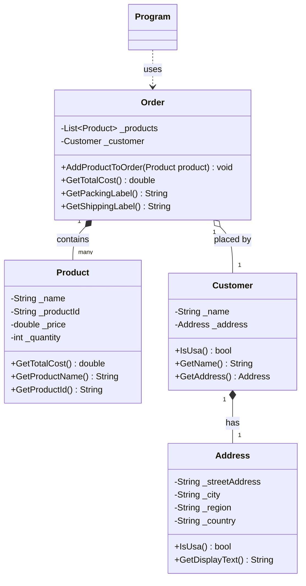

```mermaid
classDiagram

class Order {
  -List~Product~ _products
  -Customer _customer
  +AddProductToOrder(Product product) void
  +GetTotalCost() double
  +GetPackingLabel() String
  +GetShippingLabel() String
}

class Product {
  -String _name
  -String _productId
  -double _price
  -int _quantity
  +GetTotalCost() double
  +GetProductName() String
  +GetProductId() String
}

class Customer {
  -String _name
  -Address _address
  +IsUsa() bool
  +GetName() String
  +GetAddress() Address
}

class Address {
  -String _streetAddress
  -String _city
  -String _region
  -String _country
  +IsUsa() bool
  +GetDisplayText() String
}

class Program {
  
}

Order "1" *-- "many" Product : contains
Order "1" o-- "1" Customer : placed by
Customer "1" *-- "1" Address : has
Program ..> Order : uses
```