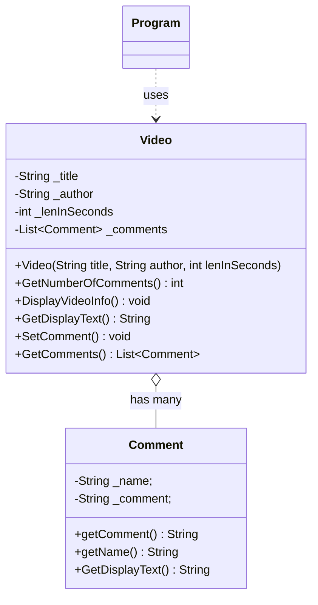

```mermaid
classDiagram

class Comment {
  -String _name;
  -String _comment;
  +getComment() String
  +getName() String
  +GetDisplayText() String
}

class Video {
  -String _title
  -String _author
  -int _lenInSeconds
  -List~Comment~ _comments
  +Video(String title, String author, int lenInSeconds)
  +GetNumberOfComments() int
  +DisplayVideoInfo() void
  +GetDisplayText() String
  +SetComment() void
  +GetComments() List~Comment~
}

class Program {

}

Video o-- Comment : has many
Program ..> Video : uses
```